# 全国海洋航行器设计与制作大赛
## C4智能导航赛道操作手册

## 1 平台简介

### 1.1平台描述

&nbsp;&nbsp;&nbsp;&nbsp;&nbsp;&nbsp;SpaceR-USV 是一款先进的智能无人船虚拟仿真训练平台，该平台由基于Unity的虚拟三维仿真引擎、基于Simulink的无人船运动模型和基于ROS的无人船航控系统三部分组成。平台基于Unity引擎进行航行场景设计和传感器数据获取，提供高逼真的视觉和物理仿真，为无人船的导航训练提供有效的模拟平台；基于Simulink搭建无人船运动数学模型，为避障算法提供符合物理规律的运动学和动力学约束，考虑风、浪、流三种环境因素的影响，在运动数学模型中加入对应干扰力的计算，使算法仿真更贴合实际；基于ROS的无人船航控系统旨在实现无人船的自主导航、任务执行和操作控制。该系统利用ROS提供的一系列工具和库，实现无人船的感知、决策和控制功能，使其能够在复杂的环境中自主航行和执行任务。

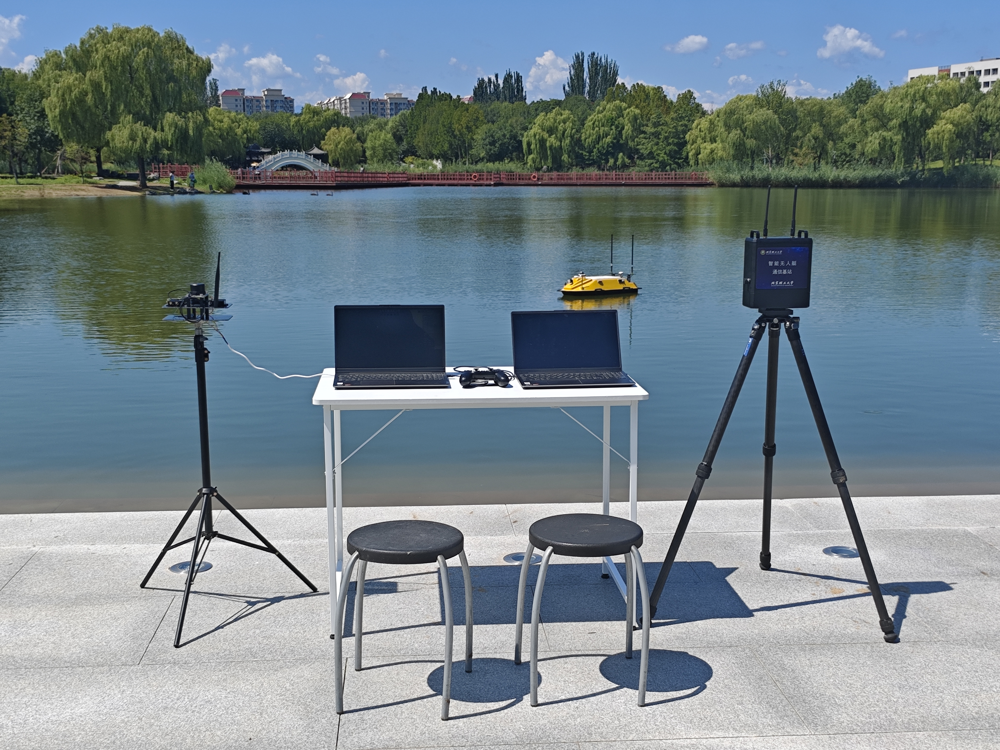


### 1.2平台框架

&nbsp;&nbsp;&nbsp;&nbsp;&nbsp;&nbsp;智能无人船虚拟仿真训练平台框架主要涉及六个模块：

- &nbsp;&nbsp; &#9679; 环境交互显示模块：提供水域地形、环境条件和船舶模型号等信息。
- &nbsp;&nbsp; &#9679; 无人艇模型：包括三维几何和物理运动模型，用于模拟无人艇的行为。
- &nbsp;&nbsp; &#9679; 环境感知模块：通过激光雷达、视觉相机等传感器收集环境数据。
- &nbsp;&nbsp; &#9679; 运动控制模：块负责无人艇的电机和舵机控制。
- &nbsp;&nbsp; &#9679; ROS数据通信模块：在各模块之间传递数据，并负责信息处理，确保系统协调工作。
- &nbsp;&nbsp; &#9679; 避障算法模块：使用强化学习（如PPO、TD3）和监督学习进行路径规划和障碍物规避，提升无人艇的自主导航能力。


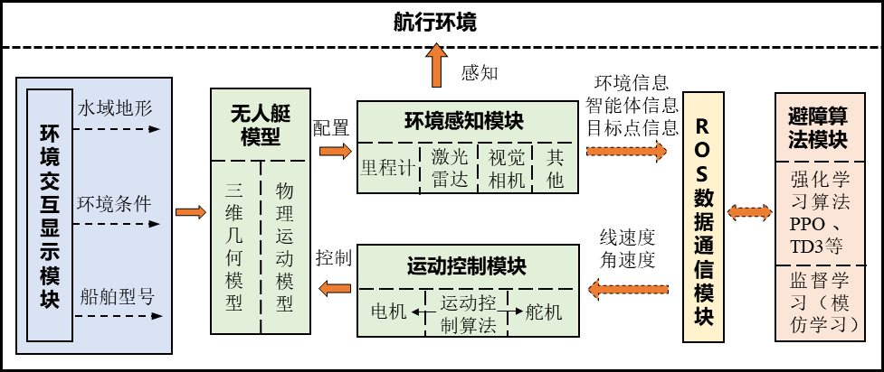

## 2 无人船硬件介绍

### 2.1 无人船船体参数

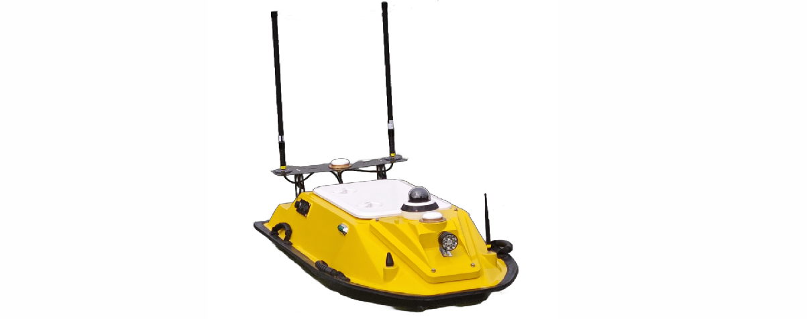

|    参数名称    |                            参数值                            |
| :------------: | :----------------------------------------------------------: |
|      船长      |                            1.3 m                             |
|      型宽      |                            0.64 m                            |
|    吃水深度    |                            18 cm                             |
|    最高航速    |         1.8 m/s（使用船自带遥控的极限速度是2.4 m/s）         |
|    船体材料    |                       玻璃纤维增强材料                       |
|    动力系统    |                        2x 喷泵推进器                         |
|  定向巡航速度  | 定速巡航速度在1-1.5 m/s时，效果较好，低于1 m/s时，电机推力会降的比较低。 |
|  定速巡航速度  |                           1.4 m/s                            |
|    续航时间    |          满功率大约2 H，限定功率测试一般可达到 4-5H          |
|    通信距离    |                           大约2 km                           |
|    转弯半径    |             油门100%，方向50%时，转向半径5m左右              |
| 最大转向角速度 |                            45 °/s                            |


## 3 部署流程

### 3.1 总体流程框架

&nbsp;&nbsp;&nbsp;&nbsp;&nbsp;&nbsp;本系统的完整部署流程由六个关键步骤依次串联完成，各步骤须按序执行，确保各组件通信正常后方可启动算法训练。整体流程如下图所示：

```
┌─────────────────────────────────────────────────────────────────┐
│                      系统部署总体流程                            │
└─────────────────────────────────────────────────────────────────┘

  ① 打开虚拟机，等待 ROS2 自启动
          │
          ▼
  ② 打开 MATLAB，启动 Simulink 水动力模型
          │
          ▼
  ③ 启动具身智能仿真平台，修改 IP 和端口号
          │
          ▼
  ④ 重启具身智能仿真平台，切换为【算法训练】模式
          │
          ▼
  ⑤ 设置config参数，运行 main 函数
          │
          ▼
  ⑥ 在具身智能仿真平台中点击【开始训练】
```

**注意：各步骤之间存在依赖关系，请严格按照序号顺序依次操作，切勿跳步或乱序执行。**

---

### 3.2 压缩包文件简介

​      **智能导航C4-2026**文件夹解压缩之后里面会有4个主要文件夹。

**1、** **ros环境**文件夹有ros2设置完备的虚拟机，只需导入即可。

**2、** **Model**文件夹提供无人船的水动力simulink模型。

**3**、 **EmBoUnity**文件夹提供具身智能仿真平台，供智能体仿真使用。

**4、** **NavAlg**文件夹提供导航避障算法，供智能体训练使用。

---

### 3.3 关键步骤详解

#### 步骤一：打开虚拟机，自启动 ROS2

&nbsp;&nbsp;&nbsp;&nbsp;&nbsp;&nbsp;打开解压文件夹：**智能导航C4-2026\ros环境**，双击 **Ubuntu 64 位.ovf** 文件，将其导入 VMware 虚拟机，设置好虚拟机名称与存储路径后启动虚拟机。登录用户名为 `c4`，密码为 `c4`，回车进入虚拟机主界面。进入主界面后**等待约 2 分钟**，系统将自动启动 ROS2 容器，**无需手动执行任何命令**。

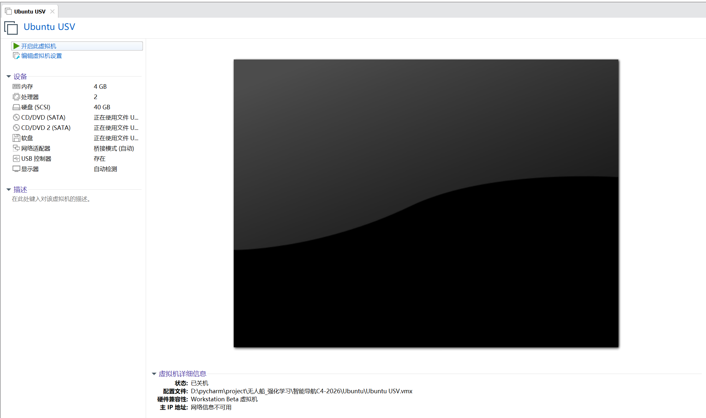

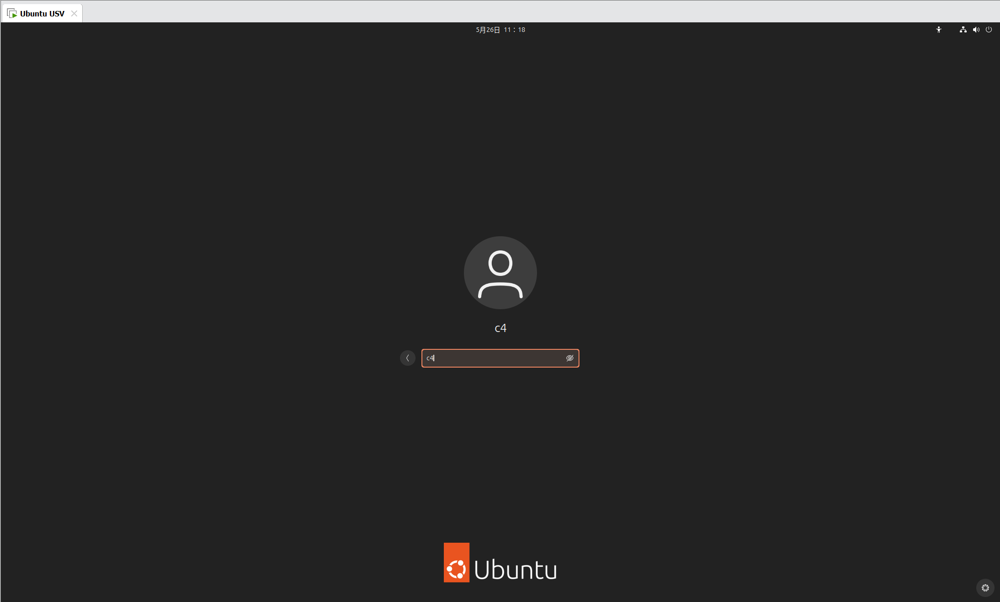

**提示：虚拟机启动后请记录当前虚拟机的 IP 地址，后续在具身智能仿真平台网络设置中需要填写该地址作为 ROS2 控制器 IP。**

---

#### 步骤二：打开 MATLAB，启动 Simulink 水动力模型

&nbsp;&nbsp;&nbsp;&nbsp;&nbsp;&nbsp;双击打开 MATLAB，在命令行中输入路径切换指令：**cd 路径名称**，进入文件夹：**智能导航C4-2026\Model\Model\C4_2026**。随后在命令行输入以下指令，等待 Simulink 自动启动并运行无人船水动力模型：

```matlab
start_simulation
```

&nbsp;&nbsp;&nbsp;&nbsp;&nbsp;&nbsp;Simulink 模型启动后，无人船的运动数学模型（包含风、浪、流干扰力解算）即开始运行，为具身智能仿真平台提供符合物理规律的动力学数据支撑。

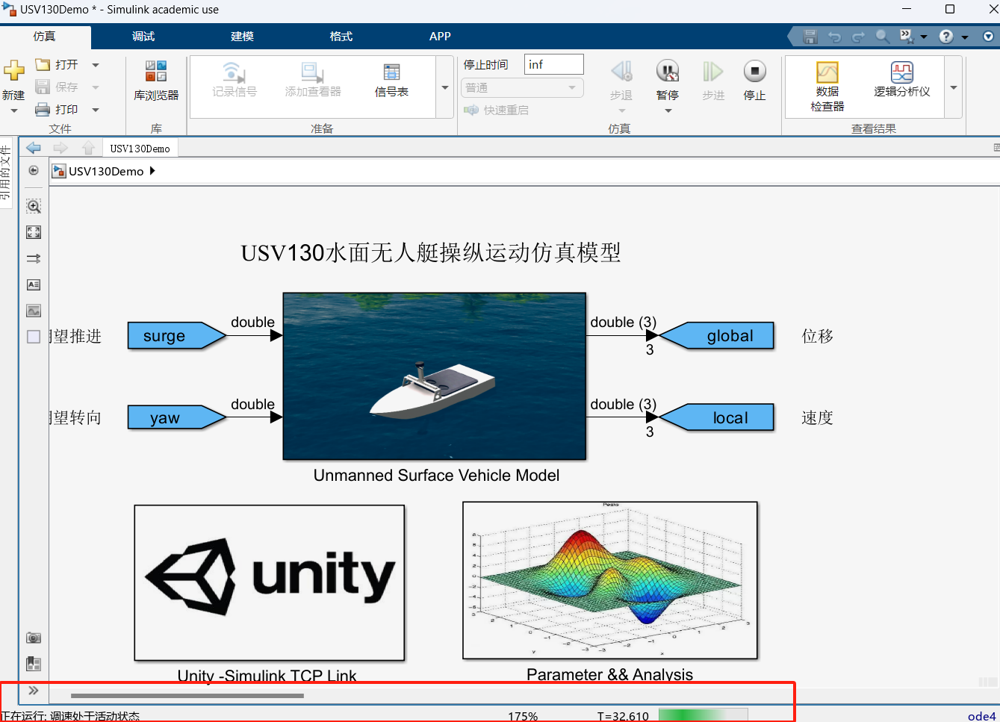

**提示：请确保 MATLAB 版本兼容，且 Simulink 模型已正常弹出窗口，方可进行下一步。**

---

#### 步骤三：启动具身智能仿真平台，修改 IP 和端口号

&nbsp;&nbsp;&nbsp;&nbsp;&nbsp;&nbsp;进入文件夹 **智能导航C4-2026\EmboUnity**，双击打开 **EmboUnity.exe**，在登录界面输入账号 `Bit01`、密码 `123456` 后登录平台（需在联网环境下运行）。进入平台后，点击菜单中的【系统设置】→【网络设置】，按以下规则填写网络参数并点击保存：

| 参数项 | 配置值 |
| :---: | :---: |
| 模型 IP | 127.0.0.1 |
| 模型接收端口 | 10804 |
| 模型发送端口 | 10805 |
| 控制器 IP | 虚拟机的实际 IP |
| 控制器端口 | 10000 |

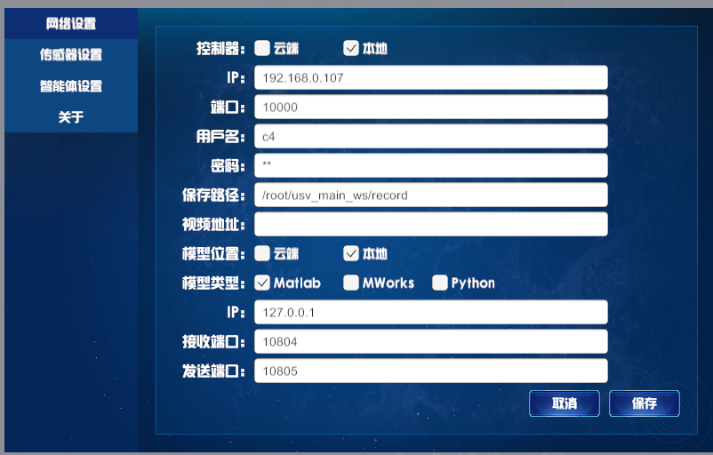

​	在系统设置中点击**传感器设置**，打开虚拟激光雷达，再点击**关于**，复制设备唯一标识，后续操作五会用到。

**注意：控制器 IP 需填写步骤一中虚拟机的实际 IP 地址，请勿填写固定值。**

---

#### 步骤四：重启具身智能仿真平台，切换为算法训练模式

&nbsp;&nbsp;&nbsp;&nbsp;&nbsp;&nbsp;完成 IP 与端口设置并保存后，**重启具身智能仿真平台**使网络配置生效。重启完成后观察界面左上角：ROS2 IP 旁的两条连接状态横线应显示为**一蓝一绿**，右侧基础状态栏中"船舶模型"应显示**通讯正常**，说明与 Simulink 模型及 ROS2 控制器的连接均已建立成功。

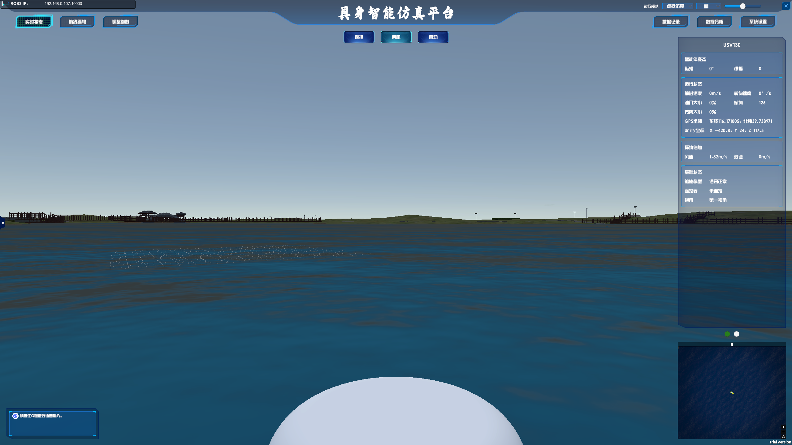

&nbsp;&nbsp;&nbsp;&nbsp;&nbsp;&nbsp;确认连接正常后，在平台右上角的【运行模式】中选择切换为**【算法训练】**模式。切换成功后，可根据需要按住 `Shift` 键在场景内点击以新增障碍物，按住 `Ctrl` 键点击可设置目标点位置。

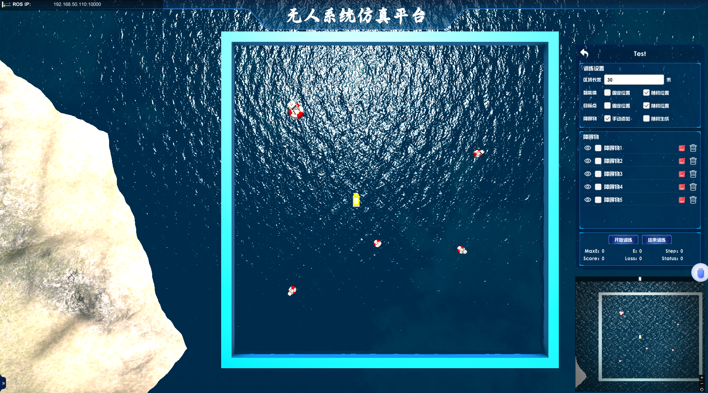

**提示：若连接横线显示异常（均为灰色或红色），请检查虚拟机是否正常运行、IP 填写是否正确，并重新保存网络配置后再次重启。**

---

#### 步骤五：设置config参数，运行 main 函数

​      在路径**智能导航C4-2026\NavAlg\NavAlg\config.json**中设置**host**为虚拟机IP地址，**port**端口为**9090**，**deviceId**为步骤三中复制的设备唯一标识。

&nbsp;&nbsp;&nbsp;&nbsp;&nbsp;&nbsp;打开以下路径所在的文件夹：

```
智能导航C4-2026\NavAlg\NavAlg\usvlib4ros\usvlib4ros
```

&nbsp;&nbsp;&nbsp;&nbsp;&nbsp;&nbsp;在该目录中找到算法主入口文件，运行 **main 函数**以启动强化学习算法进程。算法启动后将自动通过 ROS2 与仿真平台建立通信连接，订阅虚拟传感器的 Topic 数据，等待来自具身智能仿真平台的心跳信号（虚拟传感器数据流）触发训练流程。代码正常运行应在控制台有如下提示：

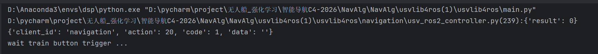

**提示：运行前请确保算法中连接的 ROS2 服务端 Host 地址与虚拟机 IP 一致，以及设备号deviceId与具身智能仿真平台系统设置-关于-设备唯一标识一致。**

---

#### 步骤六：在具身智能仿真平台中点击【开始训练】

&nbsp;&nbsp;&nbsp;&nbsp;&nbsp;&nbsp;当算法端检测到虚拟传感器数据已正常读入（通过 ROS 订阅服务收到数据），说明算法进程与仿真平台的通信链路已建立完成。此时回到具身智能仿真平台界面，点击【**开始训练**】按钮，即可正式启动强化学习训练流程。

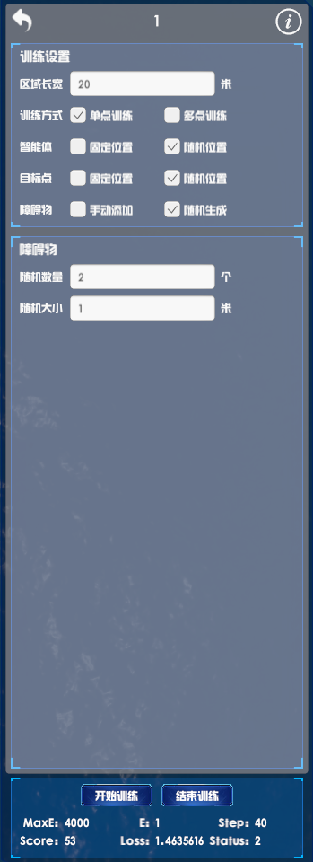


&nbsp;&nbsp;&nbsp;&nbsp;&nbsp;&nbsp;训练启动后，平台将根据预设的航线、障碍物布局和智能体参数，持续进行算法迭代与仿真推演。可在实时状态界面中观察无人船的姿态、速度、轨迹等运行状态信息。

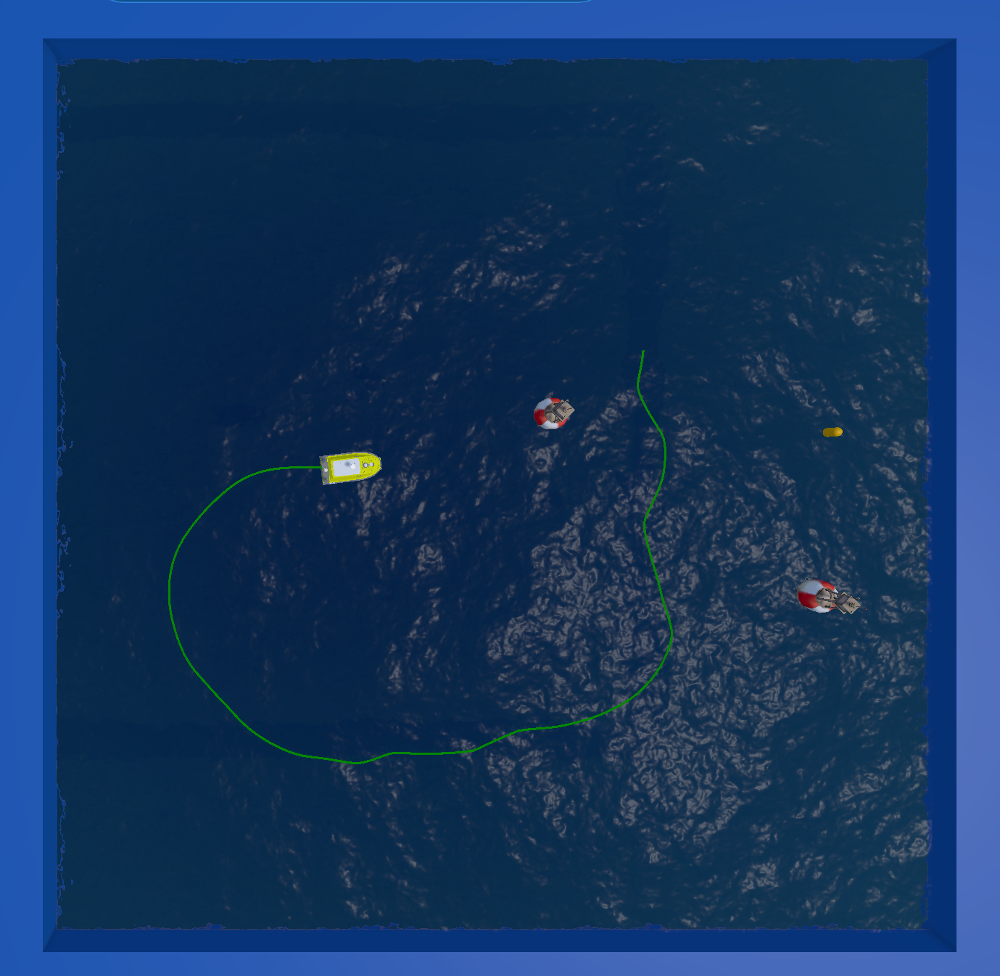

**提示：若点击【开始训练】后无响应，请检查算法端是否已成功运行且已检测到传感器数据输入，确保通信链路建立后再重新点击。**
